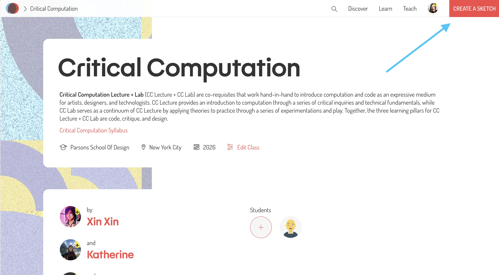
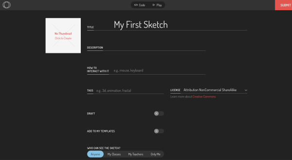
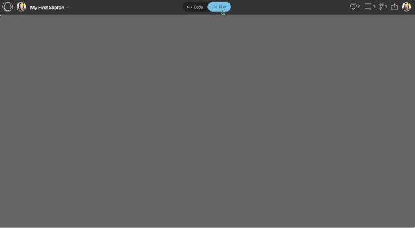
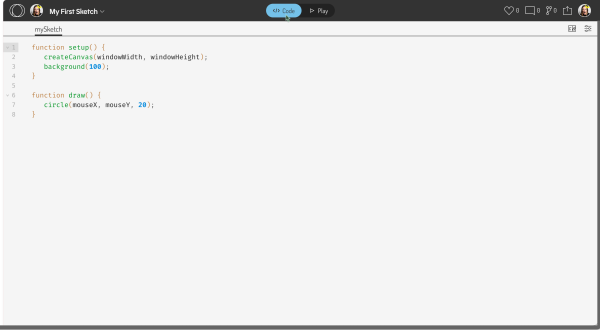
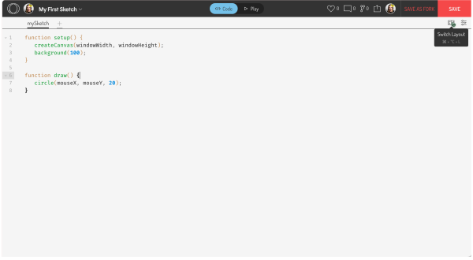
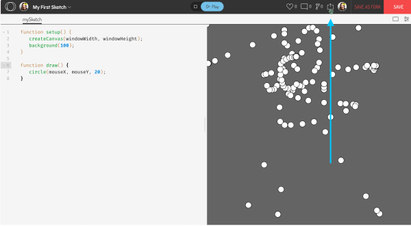
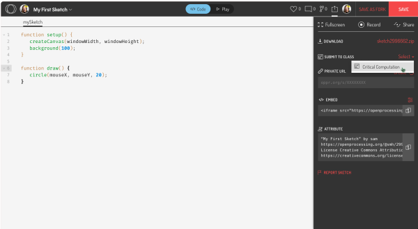
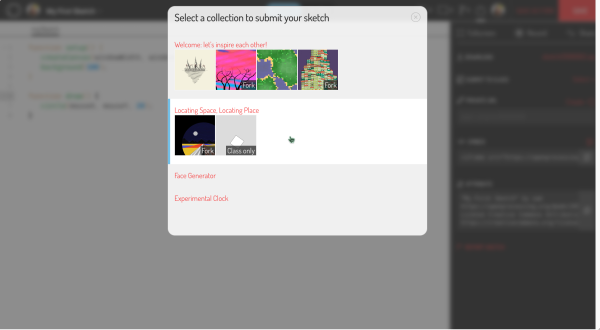
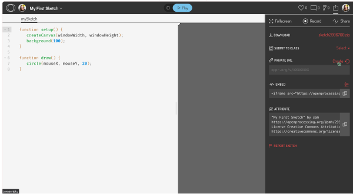
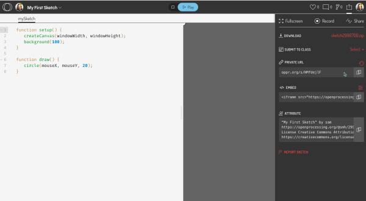

# Week 01: 8/28/26

## Agenda

1. Syllabus, Expectations and Class Manifesto
2. Introductions
3. Introduction Survey
4. Break
5. Intro to Coding
6. Tutorial: Drawing with p5.js
7. Demos, Videos, and Useful Links

## Syllabus

- Read through the [syllabus](../readme.md): https://github.com/samheckle/critical-computation-lab-fa-26 (and bookmark it! this is also where class notes will live!)
- If I am ever going too fast through _any_ material, please interrupt me!
- Questions? Comments? Needs? Etc? Send an email. I value open communication more than anything else. If you miss class, expect to be late, or are struggling with an assignment, please let me know.
### Expectations and Class Manifesto

1. Be curious!
   - what questions are you asking?
	   - See [Asking Questions](../readme#asking-questions)
   - what do you not know?
   - how can you find those answers?
     - exploring the p5.js reference is a great past time
2. Practice!
   - learning to code takes time!
   - you _will_ have to do a lot of work outside of class to understand what is going on in the context of your own projects
3. Low Stress **NOT** Low Effort
   - did you learn something new? write it in your documentation!
   - did you struggle? write it in your documentation!
   - did you accomplish what you wanted? write it in your documentation!
   - if you made a solid attempt and wrote documentation (via a discussion post) you get full credit!

### Class Format

Broadly – this is similar to a math class, sprinkled with media theory and artmaking.

You will be taught in class:

- syntax of how the coding language works
- application of how to use the coding language in your artistic practices

Outside of class:

- practice the syntax
- contextualize the content in your own projects

A typical week structure might look like:

1. Review previous week’s assignment and questions
2. Review lecture & discussion
3. Practice new content in class
   - You should be following along the demos!
4. Apply new content in upcoming assignment

## Introductions

### Me: sam heckle (they/she)

- software engineer to creative technologist pipeline
- things you can ask me about: creative coding, software engineering, net art, permacomputing, portfolio review, resume review, games, keyboards, galleries. ***please ask me about these things in [office hours](https://calendly.com/samanthaheckle/30min)***

## Introduction Survey

Please complete the [introduction survey](https://docs.google.com/forms/d/e/1FAIpQLSee-nouv-uVowfx_S8kzGU--W_RGq_98c9K2F081_HooaT-Ww/viewform?usp=dialog), depending on time we will do a lightning round of intros via a short discussion.

---
## Introduction to Code

### Tutorial: Learning about OpenProcessing

Make an account: https://openprocessing.org/join/DC1063

When creating a profile, please use your real (preferred) name. We have a large community of learners and one way we establish trust as a community is through real name usage.

#### First Sketch

Every class will include one or multiple sketches that you will be making in the OpenProcessing editor. 

#### General Flow

| How to submit homework                                                                                                                           |                                                                                            |
| ------------------------------------------------------------------------------------------------------------------------------------------------ | ------------------------------------------------------------------------------------------ |
| 1. After creating a new sketch, get in the habit of always saving your sketch first (you can also press ⌘+S or Ctrl+S)                           |                                                                       |
| 2. Name your sketch something useful. For now, we don't need to modify any of the other settings but you are welcome to change them as needed.   |                                              |
| 3. On saving, it will take you to the "Play" tab. This is how you can test your code.                                                            |                                                                |
| 4. Navigate back to the code tab. This is where we will write our code for each project.                                                         |                                                                |
| 5. You can add a "live preview" by changing the layout. *This only needs to be done once.*                                                       |                                         |
| 6. Write your code / Finish your assignment...                                                                                                   |                                                                                            |
| 7. To submit your assignments, you can click the "Share" button in the upper right corner.                                                       |                                                              |
| 8. There are a couple of different avenues to share your work.                                                                                   |                                                                                            |
| 8a. For each assignment, you will add your sketch to the assignment group.                                                                       |    |
| 8b. For any misc links you would like to share, you can generate a unique link. I will ask you to do this at the end of pretty much every class. |                        |
