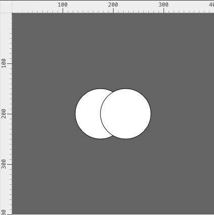
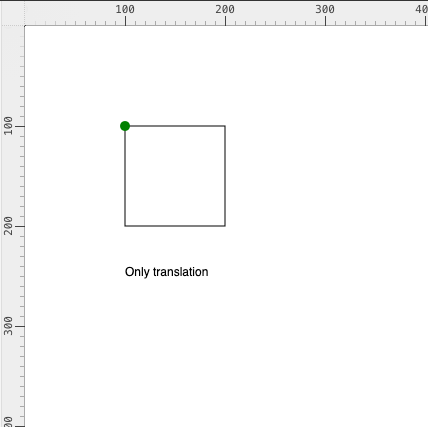
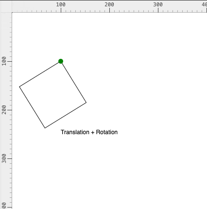

# Week 02: 9/4/2026

## Agenda

1. Reading Discussion
2. Review: 2D shapes
3. Tutorial: Colors and Translations
4. Assignment #1 [Part 1]
5. References, Useful Links, and Demos

## Reading Discussion

> As well as asking, "What is the answer to this new form of the question," one may ask, "Is this new question a worthy one to investigate?" - Alan Turing, [Computing Machinery and Intelligence](https://cbmm.mit.edu/sites/default/files/documents/turing.pdf) (1950)

Introduce yourself:
1. Name
2. Pronouns
3. Where did you come from / what were you doing before grad school?
4. 1 sentence takeaway or quote from the reading, which will be added to the [reading discussion]()

## Review: 2D shapes

Create a new sketch and recreate this image:



> As a note, in my editor settings I have turned off "Showcase Sketch".
> If you need help, you can always look at the [Shapes reference](https://p5js.org/reference/#Shape)
## Tutorial: Colors and Translations

### Adding Color

In `p5.js`, color is handled very similarly to most vector-graphic tools (ex. Adobe Illustrator). There are two main shape attributes we will modify: `fill()` and `stroke()`. 

When we use color in `p5` we pass in parameters into the `fill()` function.  There are a few types of parameters that are accepted, which we can see in the [syntax](https://p5js.org/reference/p5/fill/). But, I typically use these three:

```js
// RGB (r = 255, g = 0, b = 0)
fill(255, 0, 0)
// RGBA 
fill(0, 0, 255, 100)
// color string
// this accepts a word, wrapped in ""
fill("green")
```

We can see a full list of the named colors here: https://developer.mozilla.org/en-US/docs/Web/CSS/Reference/Values/named-color

All functions that accept color as the parameters will typically use this same format. So this works for `background()` and `stroke()` as well. 

We can also modify how colors are layered on top of one another by using [`blendMode()`](https://p5js.org/reference/p5/blendMode/). This *only* accepts specific values, that *must* be written in uppercase. You can see the full list in the [reference](https://p5js.org/reference/p5/blendMode/). 

Both of these attributes will impact *every shape that comes after it*. So if we want different shapes to have different colors, we need to add a new `fill()` to the shape.

### Grouping 

We can also force `fill()` to only apply to a specific shape by wrapping it in a layer. This is a two-part process:
1) We need to specify where the group starts with `push()`
2) We need to specify where the group ends with `pop()`

[`push()`](https://p5js.org/reference/p5/push/) and [`pop()`](https://p5js.org/reference/p5/pop/) can only be used with each other, so you cannot have a `push()` without an associated `pop()`. This works great for `fill()`, but is really important when we apply transformations.
### Transformations

There are three main transformation functions in `p5.js`:
- [`translate()`](https://p5js.org/reference/p5/translate/) - translates the coordinate system
- [`rotate()`](https://p5js.org/reference/p5/rotate/) - rotates the coordinate system
- [`scale()`](https://p5js.org/reference/p5/scale/) - scales the coordinate system


Similarly to `fill()`, any time we use `translate()`, it will impact every shape that will come after it, so we always wrap it in a `push()` and a `pop()`. Otherwise, each translation would add to the previous.

`translate()` allows us to choose where an object is rotated or scaled around. 

  






## Assignment #1 [Part 1]

In pairs, you will be swapping places that you described as a part of the assignment for today. 

5 minutes — Before swapping prompts, review your description of a place: *What do you see? Choose one frame, one view, to describe. How do your emotions and feelings about this place influence the words you choose for your description?*

5 minutes — After reviewing your description, trade your description with your partner's description. On receiving your partner's description consider: *What image comes to mind? As you begin to consider how to render this image in code, ask yourself if the image must be literal and as photorealistic as possible, or if your interpretation might include elements of abstraction or even your own personal embellishment?* 

15 minutes — On a piece of paper, sketch out your partner's description. Make a few iterations. Are there any questions that come up? How can you incorporate your own designs into this piece? 

Until the end of class — Start translating your sketch into code, using using 2D primitives, `fill()` and `blendMode()`, and `Translate()`, `Rotate()`, `Push()`, `Pop()`. What shapes do you need for your vision? How can you incorporate layering? 
## References, Useful Links, and Demos

### Extra Review Videos

- [2D Primitives](https://youtu.be/hISICBkFa4Q)
- [RGB Color and blendMode()](https://www.youtube.com/watch?v=fTEvHLLwSBE&feature=youtu.be)
- [Translate(), Rotate(), Push(), Pop()](https://www.youtube.com/watch?v=maTfm84mLbo&feature=youtu.be)

### Demos

[will be populated after class]